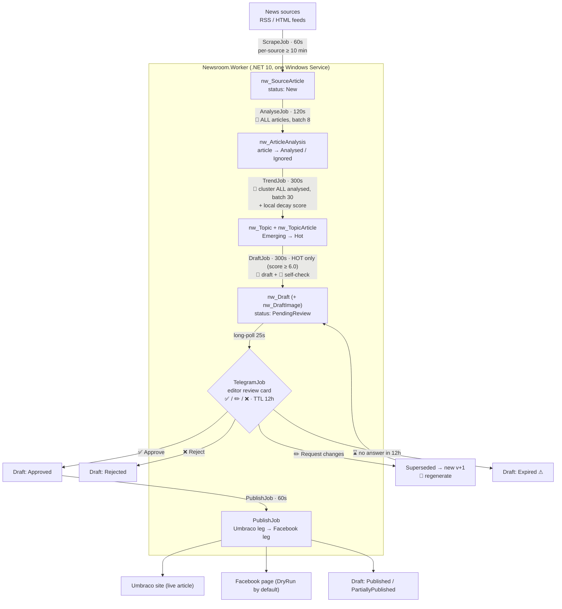
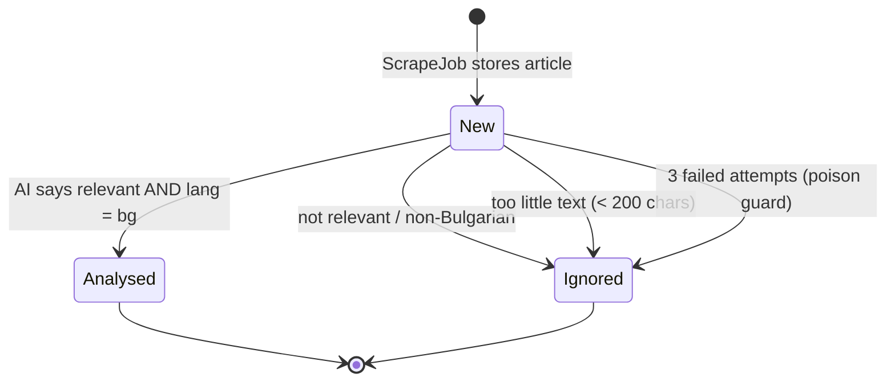
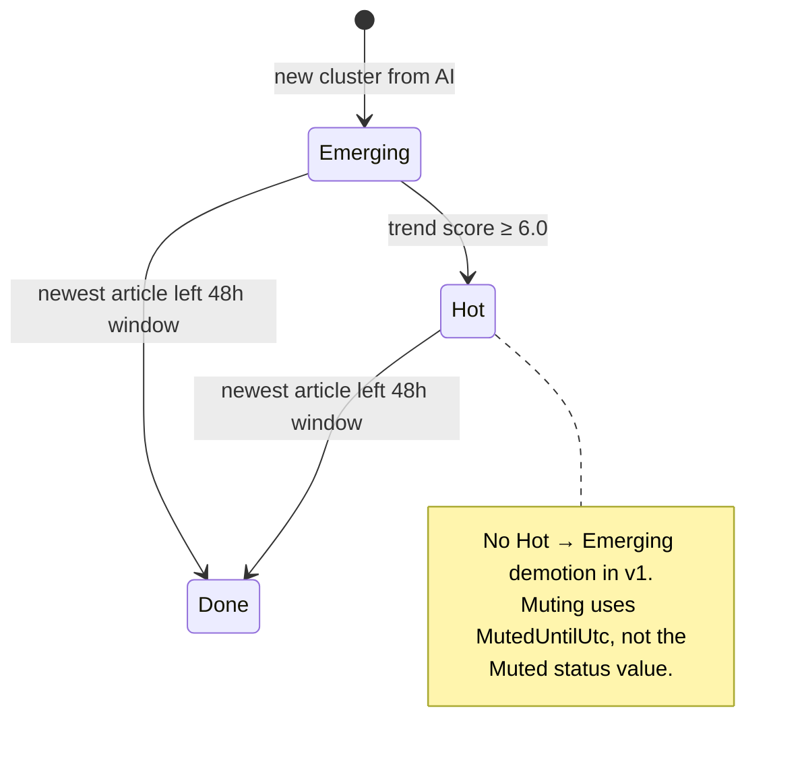
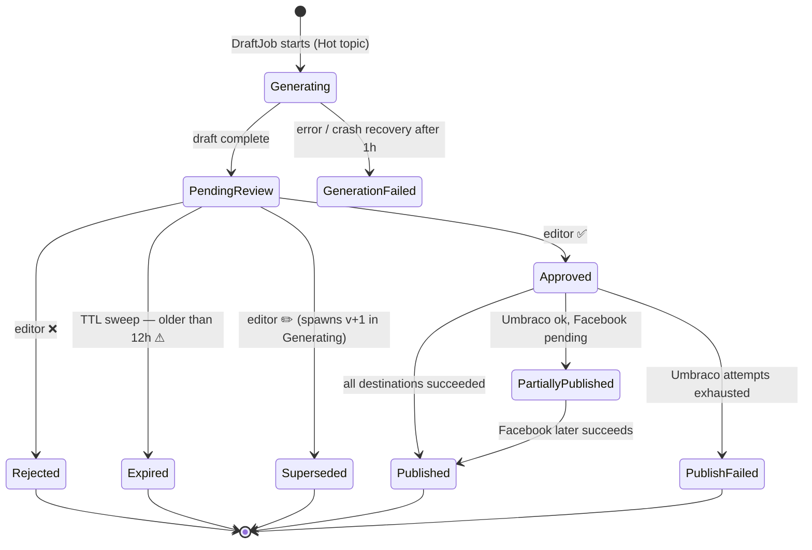

# Pipeline Flows (as-built)

**Status:** Reference · **Last updated:** 2026-07-08
**Scope:** The implemented worker pipeline, verified against source on 2026-07-08. This complements
the design-time [03-architecture.md](03-architecture.md) (which predates the Gemini switch and the
extra operational jobs) and reflects **what the code actually does today**.

> Diagrams are [Mermaid](https://mermaid.js.org/). VS Code renders them in the Markdown preview
> (Ctrl+Shift+V); GitHub renders them inline.

---

## 1. End-to-end pipeline

Single .NET 10 worker, 13 hosted services, **no message queue** — every stage is a
`BackgroundService` that polls SQL Server on a timer. The database *is* the queue; each stage
self-selects the rows in the status it consumes. 🤖 marks a Google Gemini API call.

### Where Gemini is called (4 stages, 1 request per batch/topic)

| Stage | Job | Which items → Google | Sends |
|---|---|---|---|
| Analyse | `AnalyseJob` (120s) | **Every** scraped article with ≥ 200 chars (batch 8) | Title, source, date, body (≤ 4000 chars) |
| Cluster | `TrendJob` (300s) | **Every** analysed article in the 48h window (batch 30) | Title + summary + entities (no body) |
| Draft | `DraftJob` (300s) | **Hot topics only** (trend score ≥ 6.0) | Up to 6 source articles (body ≤ 6000 chars each) |
| Self-check | `DraftJob` (300s) | Once per generated draft (Hot only) | Draft body + same source bundle |

**Key point:** Google is *not* gated on human approval — the editor reviews **after** the AI has
already drafted. The only volume gate is the trend score (Draft/Self-check). Analyse and Cluster
run for essentially every ingested article.

---

## 2. Job schedule (all 13 hosted services)

Registration order = startup order ([Program.cs:140-152](../src/Newsroom.Worker/Program.cs#L140-L152)).

| # | Job | Trigger | Cadence |
|---|---|---|---|
| 1 | MigrationStartupService | once at startup | applies SQL migrations |
| 2 | StartupRecoveryService | once at startup | `Generating` stuck > 1h → `GenerationFailed` |
| 3 | HeartbeatService | timer | 60s |
| 4 | ScrapeJob | timer | 60s check; per-source ≥ 10 min |
| 5 | AnalyseJob | timer | 120s |
| 6 | TrendJob | timer | 300s |
| 7 | DraftJob | timer | 300s |
| 8 | TelegramJob | continuous long-poll | 25s poll timeout |
| 9 | PublishJob | timer | 60s (dormant if Umbraco unconfigured) |
| 10 | FacebookTestPostService | one-shot at startup | only if `Facebook:TestPostDraftId` > 0 |
| 11 | WatchdogJob | timer | 300s; alerts if a heartbeat is > 3× its interval |
| 12 | DailyDigestJob | 60s poll | fires once/day at 09:00 VPS-local |
| 13 | RetentionJob | 60s poll | once/day; purges text/logs > 90 days |

AI stages, Telegram, and Publish **degrade to dormant no-ops** (not crashes) when their credentials
are missing; enabling them needs a process restart.

---

## 3. State machines

Three independent status machines drive the pipeline.

### 3a. `nw_SourceArticle.Status`

### 3b. `nw_Topic.Status`

### 3c. `nw_Draft.Status` — the editorial machine

---

## 4. ✅ Fixed (2026-07-08) — expiry now anchors on PostedAtUtc

> **Status:** fixed in source — migration `0010_review_posted_at.sql` + code changes below.
> The live DB already had migration `v10` applied (column + backfill); the code half was the
> missing piece. Takes effect once the Worker is rebuilt and restarted on the new build.

**The original bug:** the TTL sweep expired a draft when `Status = PendingReview AND CreatedAtUtc < now − 12h`.

- **Initial drafts:** fine — the review card is posted within one loop cycle of row creation, so
  `CreatedAtUtc ≈ posted time` and the editor really gets ~12h.
- **Regenerations (✏️):** a change request inserts a new row stamped `CreatedAtUtc = now`, but the
  row stays `Generating` until `DraftJob` produces it (300s cadence, throttled by free-tier quota —
  can stall for minutes to hours). `CompleteRegenerationAsync` then flips the **same row** to
  `PendingReview` **without re-stamping `CreatedAtUtc`**
  ([DraftRepository.cs:216-227](../src/Newsroom.Infrastructure/Repositories/DraftRepository.cs#L216-L227)).
  So the 12h clock counts from the *change-request* time, not from when the new card was shown.
  A slow regen leaves the editor < 12h; a regen that took ≥ 12h is marked "⌛ Изтекло" on the very
  next sweep — the editor gets **zero** time.

**Root cause:** there was no posted-at column, so the sweep anchored on `CreatedAtUtc` as a proxy.

**Fix (implemented):**
- `0010_review_posted_at.sql` — adds `PostedAtUtc datetime2 NULL`; backfills already-posted drafts
  (`PostedAtUtc = CreatedAtUtc WHERE TelegramMessageId IS NOT NULL`) so pre-existing rows keep their
  original clock rather than becoming non-expirable.
- `ReviewRepository.SetTelegramMessageIdAsync` — stamps `PostedAtUtc = SYSUTCDATETIME()` when a
  review card is posted, guarded to `Status = PendingReview` (the method is reused for regen-failure
  notices on `GenerationFailed` drafts, which must not start a review clock).
- `ReviewRepository.ExpireStaleAsync` — expires on `PostedAtUtc < @cutoffUtc`; a not-yet-posted
  `PendingReview` draft has `PostedAtUtc NULL` and is correctly excluded (never expires unseen).
- `DraftRepository.CompleteRegenerationAsync` — resets `PostedAtUtc = NULL` (alongside
  `TelegramMessageId = NULL`) so a regenerated version restarts its TTL from when the *new* card is
  posted, not from the change-request time.

There is still no automated test for expiry — the project has no DB integration harness (raw
SQL Server T-SQL). Verified via build + migration guard tests + live schema/data inspection.

---

## 5. Google API free-tier limits (todo #3)

Gemini free tier as of 2026-07 (Flash tier only; **limits churn — re-verify in AI Studio**):
**~15 RPM / ~1,500 RPD**, shared 250K TPM. Free-tier prompts/responses are used to train Google's
models (public news content only, accepted per ADR-0010). See the project's own note
[research/2026-07-free-ai-providers.md](research/2026-07-free-ai-providers.md).

How the worker stays inside that envelope (all in `appsettings.json` / `AiRateLimiter` / `AiBudget`):

- **Process-wide throttle:** 8 requests/min (`Ai:RequestsPerMinute`), shared across all stages,
  unlimited queue — callers wait, never rejected.
- **Per-stage daily budgets** (rows counted in `nw_CostLedger`): Analyse 1000, Cluster 300,
  Draft 100, Self-check 100 → **1,500/day combined**, matching the free RPD ceiling.
- **No in-call retry:** 429 / `RESOURCE_EXHAUSTED` / 503 are classified transient and retried on a
  later cycle without burning the item's attempt count.

⚠ **Two things to double-check with Tencho:**
1. **Model id.** All four stages are configured to **`gemini-3.5-flash`**
   ([appsettings.json:54,61,68,77](../src/Newsroom.Worker/appsettings.json)); the code fallback is
   `gemini-2.5-flash`. Confirm `gemini-3.5-flash` is a valid, available model id — if not, the SDK
   call will fail (and the free-tier RPD for whichever model is actually served may differ).
2. **RPD volatility.** Google cut some Flash free limits during 2025–2026 (reports range from
   250 to 1,500 RPD). If the served model's real RPD is well below 1,500, the Analyse budget (1000)
   alone can exhaust it. Verify the live number at the AI Studio rate-limit dashboard.

---

## Source references

`src/Newsroom.Worker/Jobs/` — `ScrapeJob`, `AnalyseJob`, `TrendJob`, `DraftJob`, `TelegramJob`,
`PublishJob`, `WatchdogJob`, `DailyDigestJob`, `RetentionJob`, `StartupRecoveryService`;
`Program.cs`, `appsettings.json`.
`src/Newsroom.Infrastructure/Ai/` — `GeminiAiClient`, `GeminiClusteringAi`, `GeminiDraftingAi`,
`GeminiChatClientFactory`, `AiRateLimiter`, `AiBudget`.
`src/Newsroom.Infrastructure/Repositories/` — `AnalysisRepository`, `TopicRepository`,
`DraftRepository`, `ReviewRepository`, `PublishRepository`.
`src/Newsroom.Core/Trends/` — `TrendScorer`, `TrendScorerOptions`.
